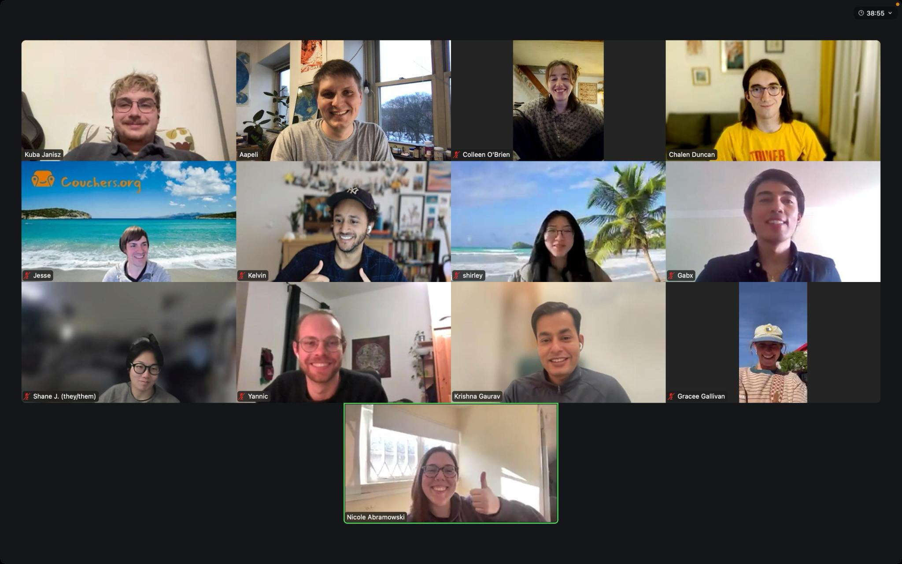

# Couchers community is growing

Hi everyone, there’s been a lot going on behind the scenes and we’re all excited to share a few updates and keep growing our Couchers community! We’ve recently sent out a volunteer newsletter to help us re-engage previous contributors, set up Zulip for community builders, and we’d love to see all of you Couchers members help us to continue making this an active and inclusive community for all of us.

## 🤝How you can get involved🤝

Our mission is to create genuine real-world connections and community. Our current milestone is preparing to move out of beta-phase and we are getting ready for a v1 launch soon! To make Couchers even better, we need your support - engage in your community!
Read more about [our mission and values](http://couchers.org/mission) and reach out to us if you have any questions or feedback.
[Help center](https://help.couchers.org/)
[Contact us](https://couchers.org/contact)

As a member, you can contribute in lots of different ways:

✨Spread the word! Invite friends to sign up at [Couchers.org](https://www.couchers.org)
🎉Create or attend events in your community
📝Complete your profile and write references
📱Share on social media \[links here !]
🤝[Volunteer](https://couchers.org/volunteer) with us! We’re really friendly!
💖[Donate](https://couchers.org/donate) to support our mission

## 🛡️Safe & active community🛡️

We’ve achieved a lot since our last blog post! Our amazing team of volunteers have been working away in the background and we’re continually doing our best to make Couchers even better. For a full list of updates check out our [Roadmap](https://www.couchers.org/roadmap)

🔒We’ve rolled out Strong Verification
🌍Completed translating Couchers.org to German, Portuguese (Brazil) and mostly Simplified Chinese
📝Volunteer newsletter and Zulip for community builders
🏅Released Badges
🔧We addressed major tech debt and lots of under-the-hood fixes!

## 🎉New feature alert!🎉

Communities now have a Members tab where you can see all members of that community.

Get active in your communities! Not much going on in your local community? Start a discussion, create an event, host surfers, and meet amazing new people. If you’re interested in helping to grow Couchers.org and improving the couch surfing community, consider becoming a [Community Builder!](https://docs.google.com/forms/d/e/1FAIpQLSeactITjrAUVjUg80gFIjxweK3-oPsgwoBmaAe0RJcjdL2xGw/viewform)

## 🚀Exciting milestones coming up🚀

We’ve got big goals and with our v1 launch in the works, these are the main priorities we’re focusing on at the moment:

🗺️Rebuilding and improving the map search
📊Building a system to keep track of active members
🔔Push notifications
🔒Strong Verification and phone number verification to increase safety
📈Revamp the blog to keep you all in the loop, including monthly dev statistics!
🌐Language picker to change preferred language
🌟Improving the reference system
🚀Promote Couchers and grow the community!

For more detailed updates on the technical side, check out our [GitHub](https://github.com/Couchers-org). Friendly reminder that Couchers is entirely built and maintained by volunteers in our free time! We’re passionate about couch surfing and are always looking for ways to improve Couchers for all of us in the community.

Want to help us make Couchers the best, safest, most active and inclusive couch surfing community? Get involved however you can!

Thanks from all of us at Couchers.org and we’re excited for what’s next in 2025!

\[links for sharing etc here !]

@couchers.bsky.social
@couchersorg ig