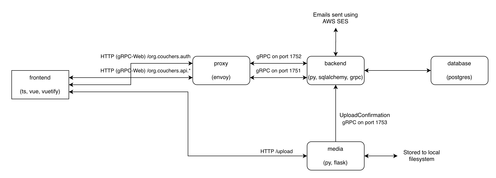

# Architecture Overview

## High-level components

There's a backend written in Python (in `//app/backend`), and a web frontend written in TypeScript with React (in `//app/frontend/couchers-web`).

The web frontend is a static app that we deploy on a CDN (AWS CloudFront through an S3 bucket). The web frontend talks to the backend through gRPC, a Remote Procedure Call library that uses Protocol Buffers, or protobufs (in `//app/proto`). gRPC uses HTTP/2 framing but is not fully compatible with the web HTTP/2 so we use gRPC-Web that works with any version of HTTP along with a proxy that translates the two when using these in the browser. For that there's Envoy proxy (in `//app/proxy`). Additionally the deployed version has an nginx reverse proxy for TLS termination (in `//app/nginx`).

User media is uploaded to the media server (in `//app/media`). It's built into a different container and will eventually run on a different machine. The purpose is to isolate user content (which can potentially be arbitrary user content) from the main server. It's also served off a different domain for cookie protection and CSP reasons.

Everything's built into docker containers and can be spun up together with `docker-compose`. This gives us an easy way to deploy the app, as well as some isolation and reproducibility afforded by containerisation.

The `//app/deployment` folder contains code for deploying the app. The app is literally composed of stuff in this repo and a few config files (with API keys, etc) dropped in `//app`. `//app/deployment/deps.sh` should basically install all dependencies. You'd need to tweak the `nginx` container though and rebuild the containers if you wanted to deploy on a different domain.
