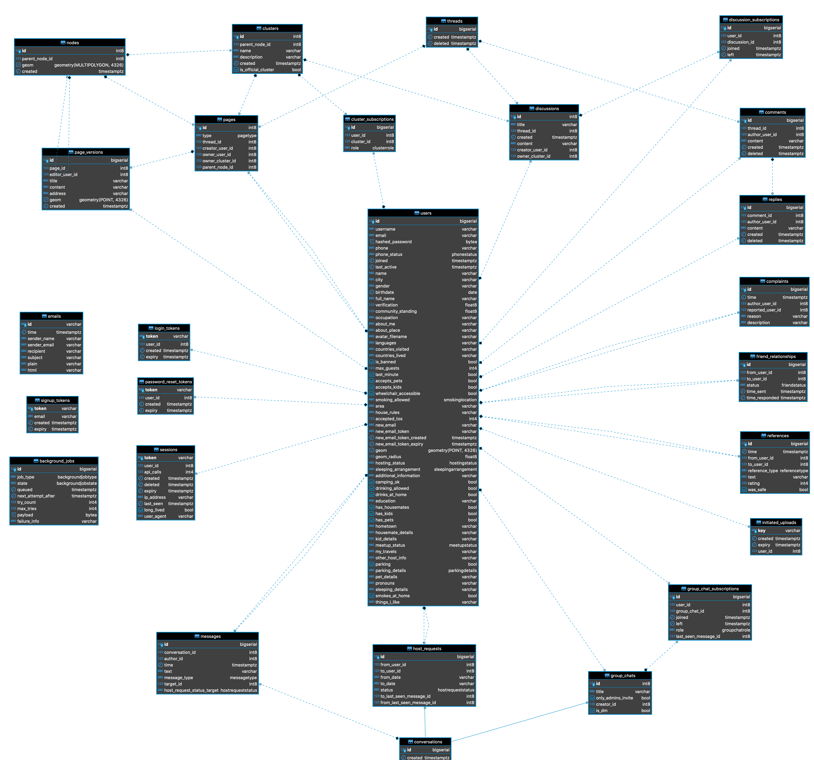
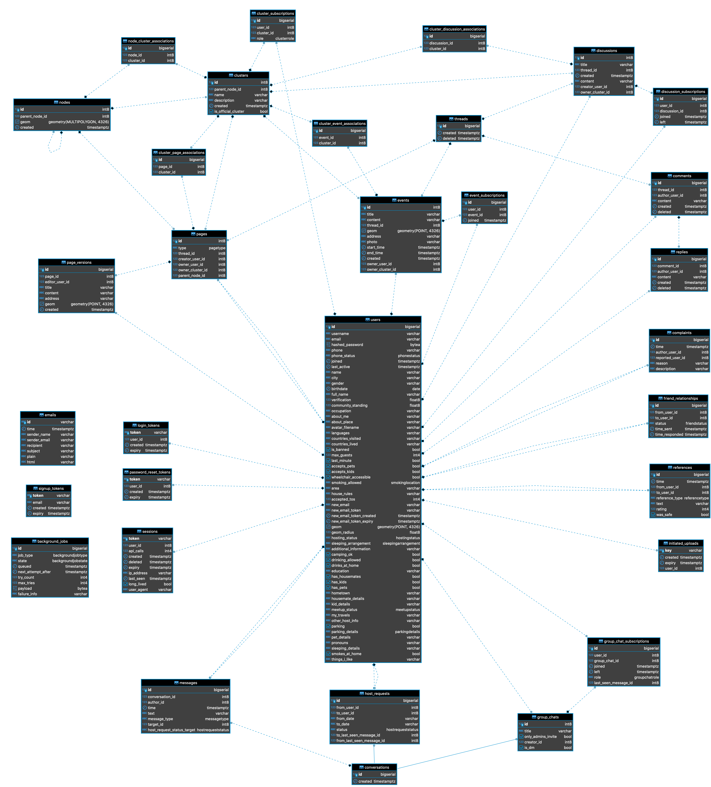

# Database schema

## Current database schema used by the backend

## Full database schema to eventually be used by the backend

## ER diagram generation

1. Install [DBeaver](https://dbeaver.io/download/)
2. [Run the app locally](https://github.com/Couchers-org/couchers/tree/schema/app)
3. Open DBeaver and connect to the existing database
    - Select `PostgreSQL`, click `Next >`
    - If the popup to download PostgreSQL driver files appears, click `Download`
    - Set the `Port` to `6545`  
      (This is the value of `PGPORT` in `couchers/app/postgres.dev.env`)
    - Set the `Username` to `postgres`
    - Set the `Password` to `203d805f4b62c0a1b2f1f6b82d4583dfe563ec1619b83ce22ee414e8376a25e7`  
      (This is the value of `POSTGRES_PASSWORD` in `couchers/app/postgres.dev.env`)
    - Click `Test Connection ...`, and hopefully see `Connected` among other connection information  
      (If not, check that the other fields make sense, such as the `Host` being `localhost`)
    - Click `Finish`
4. View the ER diagram
    - Expand `postgres - localhost:6545`
    - Expand `postgres`
    - Expand `Schemas`
    - Right click `public`, and click `View Diagram`

Note that if you wish to save a `.png` of the current state of the diagram, you can click the fourth rightmost icon at the bottom right corner of the DBeaver interface.
