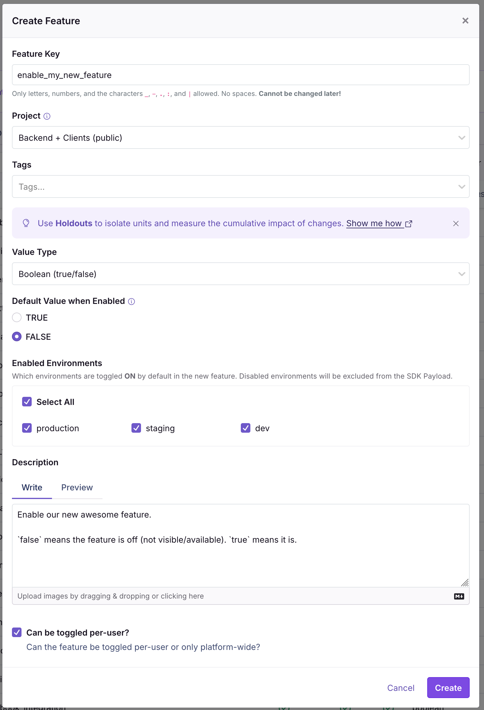
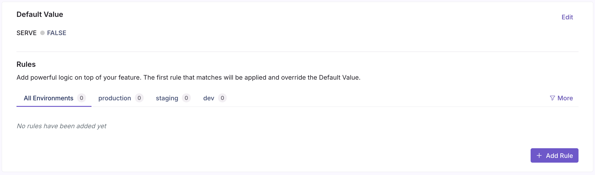
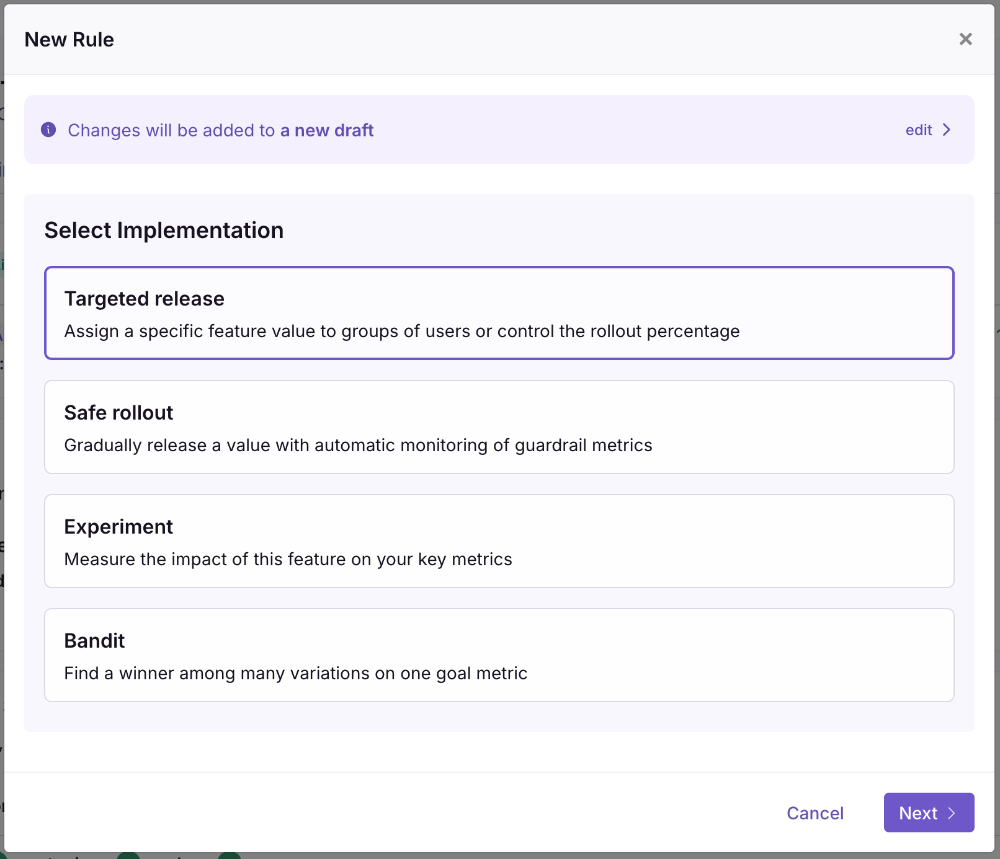
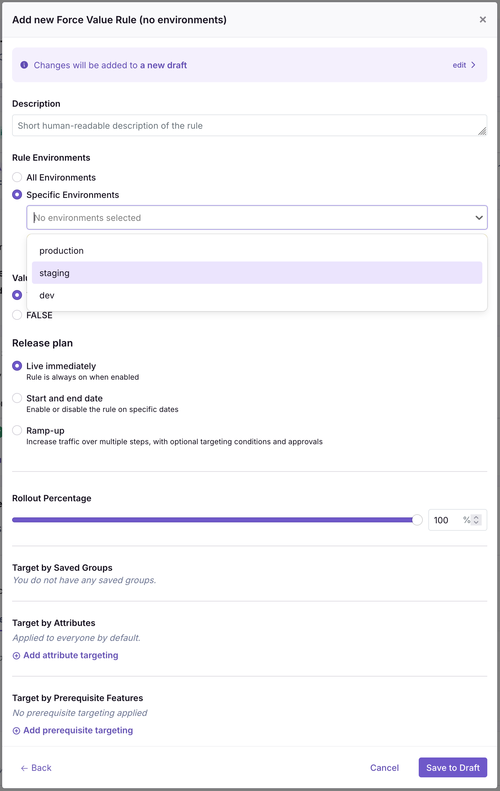

# Feature flags

Feature flags are a way to modify the running app config while it's running, as well as serve a slightly different experience to different users (e.g. to do gradual rollouts).

This is achieved by having the backend, frontend, and apps pull the latest feature flag setup from a service called Growthbook (which we host at <https://express.couchershq.org/>), which defines what the flag values are for every user.

The backend is guaranteed to have at most 1 minute propagation delay, the frontend and apps should have at most 5 minutes staleness. The backend pulls the feature flags from Growthbook every minute via the API (and persists the last version so it remembers this on startup). The frontend and apps pull it from the CDN, refreshing every minute, but using up to 5 mintue stale flags in case of a fresh load (to not increase page load times significantly). The hosting setup allows Growthbook to go down temporarily (but not during feature flag updates), while still serving the latest versions of flags to all users.

## How to add a new feature flag

First, pick a name. Make it descriptive, e.g. `enable_my_new_feature`.

Pick a default: it should be the "off" version: where prod does not break if it falls back to a default. For `enable_my_new_feature`, it would be `false`.

See the *Local development* section below for how to enable the feature flag for local testing.

### Adding it to Growthbook

If you have access, you can then add it to the feature flag service. If not, ask someone with access (e.g. the leads). Go to <https://express.couchershq.org/features>, click on "Add feature". Fill out the form as follows:

* **Feature key**: is the name you gave it.
* **Project**: if it should only be available in the backend, choose that, otherwise if you need to use it on both backend and apps, choose "Backend + clients".
* **Tags**: don't add tags.
* **Value Type**: pick the right data type from "Value Type"
* **Default Value when Enabled**: set this to the **same value as the default you chose** earlier.
* **Enabled Environments**: Enable all environments.
* **Description**: Give it a meaningful description in Markdown.
* **Can be toggled per-user?** tick this if you always use this via `context` in the backend, and if it is possible enable this feature per-user. E.g. some background jobs cannot be toggled per-user as they either run or don't run, or some backend sampling logic that is not associated to users. On the other hand, even if it doesn't make much sense to show a feature per-user, but it is possible, you should tick this option. It tracks possibility, not whether it makes sense.

## Local development

The local backend does not pull the feature flags from the server, instead it resolves them from the override file in `feature-flags.dev.json`. You should set a value here that makes sense for devs developing locally (e.g. enable experimental features), and you can use it for local debug/testing temporary overrides (but don't commit this).

TODO: there is currently no such mechanism in the frontend; you can just manually modify the place where you check the flags.

## Setting the value of a feature flag to a non-default value

To set the value of a feature flag to a non-default value for everyone for a given environment, follow this process:

1. **Click on "Add Rule"**
  
2. **Choose "Targeted release"**
  
3. **Select environments**: if you want this value to apply for all environments, select "all", otherwise, select the environment you want (e.g. staging/production)
  
4. **Select the value you want to set**
